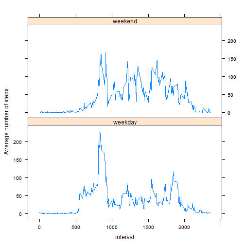

## Loading and preprocessing the data


```r
data<-read.csv("activity.csv")
```

## What is mean total number of steps taken per day?

How many steps were taken per day?

```r
x<-tapply(data$steps,data$date,sum)
hist(x,xlab="Number of steps/day",main="Histogram of steps/day",las=1)
```

 
With mean and median steps per day:

```r
mean(x,na.rm=T)
```

```
## [1] 10766
```

```r
median(x,na.rm=T)
```

```
## [1] 10765
```


## What is the average daily activity pattern?

What interval has the highest average number of steps?


```r
x<-tapply(data$steps,data$interval,mean,na.rm=T)
plot(x,xlab="Interval",ylab="Mean number of steps",type="l",las=1)
```

 


```r
int<-c(1:length(x))[x==max(x)]
```

```r
time<-as.numeric(names(x[x==max(x)]))
```

The maximum steps occurred during interval 104 at time 835.


## Imputing missing values


```r
missed<-sum(is.na(data$steps))
```
The number of missing values is 2304.

There are eight missing days.  To impute the values for the intervals on these days, I will use the mean number of steps for each interval on the days when steps were recorded:


```r
for (i in unique(data$interval)) {
  data$steps[is.na(data$steps) & data$interval==i]<-mean(data$steps[data$interval==i],na.rm=T)
}
```
Histogram with imputed values, and new mean and median steps/day:

```r
x<-tapply(data$steps,data$date,sum)
hist(x,xlab="Number of steps/day",main="Histogram of steps/day with imputed missing values",las=1)
```

 
With mean and median steps per day, imputed values included:

```r
mean(x,na.rm=T)
```

```
## [1] 10766
```

```r
median(x,na.rm=T)
```

```
## [1] 10766
```
The mean number of steps/day has not changed, unsurprisingly since we replaced each missing interval with the mean value for the interval.  The median has increased slightly, again not surprisingly, as we essentially replaced the number of steps on the missing days with the daily mean, which is slightly larger than the median.   

## Are there differences in activity patterns between weekdays and weekends?

Create a factor indicating weekday or weekend:


```r
data$weekday<-"weekday"
data$weekday[weekdays(as.Date(data$date)) %in% c("Saturday","Sunday")]<-"weekend"
```

Create a plot of average steps per interval for weekdays v. weekends.

```r
library(lattice)
```

```
## Warning: package 'lattice' was built under R version 3.0.3
```

```r
x<-aggregate(data$steps,list(interval=data$interval,weekday=data$weekday),mean)
xyplot(x~interval|weekday,data=x,type="l", ylab="Average number of steps",layout=c(1,2))
```

 

There do appear to be some differences between weekdays and weekends. The mystery individual looks to exercise weekday mornings and then is reasonably sedentary.  On the weekends, s/he is moderately active throughout the day and stays active later into the evening.
